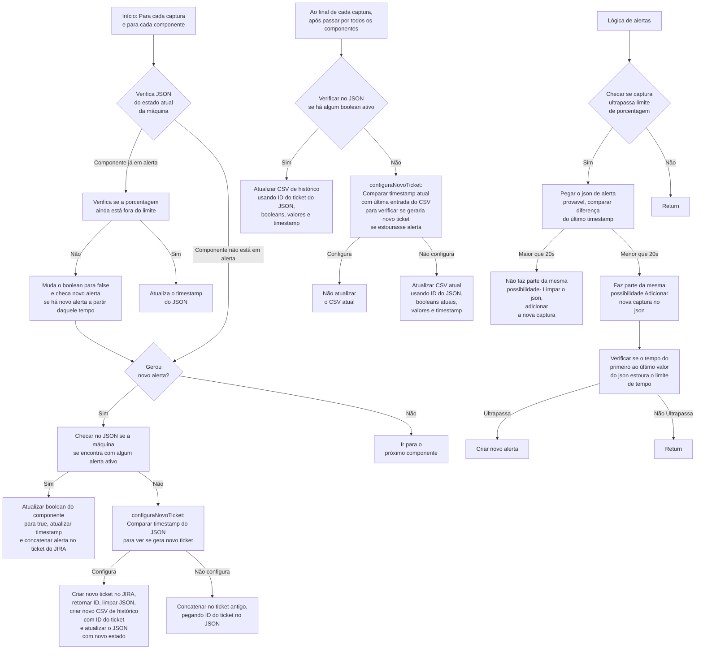

```mermaid
flowchart TD
    A["Início: Para cada captura<br>e para cada componente"] --> B{"Verifica JSON<br>do estado atual<br>da máquina"}

    B -->|"Componente já em alerta"| C["Verifica se a porcentagem<br>ainda está fora do limite"]

    B -->|"Componente não está em alerta"| D{"Gerou<br>novo alerta?"}

    C -->|"Não"| E["Muda o boolean para false<br>e checa novo alerta<br>se há novo alerta a partir daquele tempo"]

    C -->|"Sim"| F["Atualiza o timestamp<br>do JSON"]

    E --> D

    D -->|"Sim"| G["Checar no JSON se a máquina<br>se encontra com algum alerta ativo"]

    D -->|"Não"| H["Ir para o<br>próximo componente"]

    G -->|"Sim"| I["Atualizar boolean do componente<br>para true, atualizar timestamp<br>e concatenar alerta no ticket do JIRA"]

    G -->|"Não"| J["configuraNovoTicket:<br>Comparar timestamp do JSON<br>para ver se gera novo ticket"]

    J -->|"Configura"| K["Criar novo ticket no JIRA,<br>retornar ID, limpar JSON,<br>criar novo CSV de histórico<br>com ID do ticket<br>e atualizar o JSON<br>com novo estado"]

    J -->|"Não configura"| L["Concatenar no ticket antigo,<br>pegando ID do ticket no JSON"]

    Z["Ao final de cada captura,<br>após passar por todos os componentes"] --> Y{"Verificar no JSON<br>se há algum boolean ativo"}

    Y -->|"Sim"| W["Atualizar CSV de histórico<br>usando ID do ticket do JSON,<br>booleans, valores e timestamp"]

    Y -->|"Não"| X["configuraNovoTicket:<br>Comparar timestamp atual<br>com última entrada do CSV<br>para verificar se geraria novo ticket<br>se estourasse alerta"]

    X -->|"Configura"| U["Não atualizar<br>o CSV atual"]

    X -->|"Não configura"| P["Atualizar CSV atual<br>usando ID do JSON,<br>booleans atuais,<br>valores e timestamp"]

    S[Lógica de alertas] --> T{"Checar se captura<br>ultrapassa limite<br>de porcentagem"}

    T -->|Sim| M["Pegar o json de alerta<br>provavel, comparar diferença<br>do último timestamp"]

    T -->|Não| N["Return"]

    M -->|Maior que 20s| O[Não faz parte da mesma<br>possibilidade- Limpar o json,<br>adicionar<br>a nova captura]

    M -->|Menor que 20s| Q[Faz parte da mesma<br>possibilidade Adicionar<br>nova captura no<br>json]

    Q --> R

    R[Verificar se o tempo do<br>primeiro ao último valor<br>do json estoura o limite<br>de tempo]

    R --> |Ultrapassa| Ç["Criar novo alerta"]

    R --> |Não Ultrapassa| V["Return"]

```
